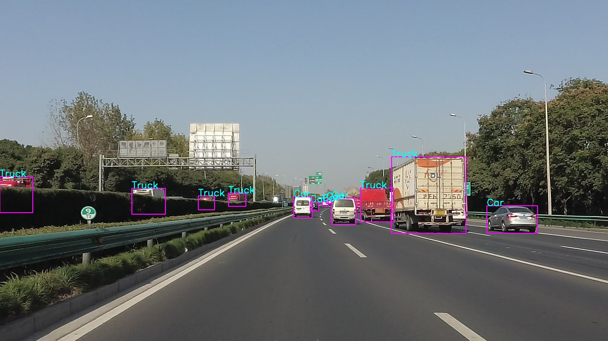
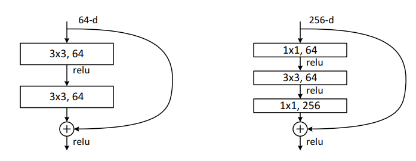

# Assignment 1 - Computer Vision: Object Detection for Autonomous Driving

In this assignment, you will develop an object detection system for autonomous driving. You are required to **implement a simple detection network** called *HKUMMDetector (Naïve Version)* with ResNet as Backbone and YOLO as detection head. Through this assignment, you are expected to learn about designing and optimizing an object detection network.

**Github Link: [https://github.com/Liang-ZX/HKU-DASC7606-A1](https://github.com/Liang-ZX/HKU-DASC7606-A1)**  
**PDF File: [Problem-Description.pdf](Problem-Description.pdf)**  
**Authors (TAs): Zhixuan Liang, Haibao Yu**  
**Date: 2022.12**

This codebase is only for HKU DASC 7606 (2022-2023) course. Please **don't upload your answers or this codebase** to **any** public platforms (e.g., Github) before permitted. All rights reserved.

## 1. Problem Description and Assignment Objectives
### 1.1 What is Object Detection for Autonomous Driving?
Object detection is one of the most essential tasks in autonomous driving. 
This task aims to recognize and localize traffic participants, like cars in the road scene, from images or point clouds. This assignment focuses on solving the detection problem from a single image.
<!--  -->
<div align="center">
  
</div>
<p align="center">
  Figure 1. A Visualization Example of Object Detection for Autonomous Driving.
</p>


### 1.2 What will you learn from this assignment?

- Understand the basic theories of Deep Learning exspecially for object detection task, such as the networks of [**ResNet**](https://arxiv.org/abs/1512.03385) and [**YOLO v1**](https://arxiv.org/abs/1506.02640), the detection loss function, and important concepts of object detection (e.g. **ROC Curve and Mean AP**).
- Apply object detection algorithm to solving **autonomous driving problem**, such as detecting cars and pedestrians in the traffic environment.
- Gain experience of implementing neural networks with a popular deep learning framework [**PyTorch**](https://pytorch.org/).
- Develop a deep learning system **from scratch**, including **network design, model training, hyperparameter tuning, training visualization, model inference and performance evaluation.**
- *Spontaneously and deeply explore advanced solutions for object detection task. (Italics indicate bonus requirements, the same below.)*

### 1.3 What should you prepare for this assignment?

- Master the basic use of Python and Pytorch.
- Be familiar with the [**ResNet**](https://arxiv.org/abs/1512.03385).
- Be familiar with the [**YOLO v1**](https://arxiv.org/abs/1506.02640).

（You can learn about them step by step in the process of completing this assignment.）

## 2. Assignment Tasks

- You must fill in the blanks and submit the completed codes for this assignment with the provided codebase. This assignment offers an incomplete codebase for object detection with modified [**YOLO v1**](https://arxiv.org/abs/1506.02640). 

+ You must submit the test data's model outputs with your completed codes. The test part of the dataset will be released seven days before the submission deadline. You should utilize hyperparameter tuning and other widely-used techniques to improve detection performance.

- You must submit a maximum of 6-page technique report to explain how you improve the object detection performance. Besides, some visualization results (e.g., loss curve) are encouraged in this report.

```shell
# Download this project
git clone https://github.com/Liang-ZX/HKU-DASC7606-A1.git
cd HKU-DASC7606-A1
```

### 2.0 Dataset Preparation
The dataset is available [here](https://drive.google.com/file/d/1WhC8AsloaEUipGCQQncYir9Q-Kb9meTC/view?usp=sharing).
The dataset is composed of train, val, test parts and their corresponding annotations. Now the test part has not yet released.
We will release the test images without the annotations later (7 days before submission deadline; **Will be released in Github**).
Please refer to [src/data/README.md](./src/data/README.md) for the dataset strcuture explanation.

For your convenience, you can download the dataset through the following command.
```shell
cd src
chmod +x data/download.sh
./data/download.sh
```


### 2.1 Submit the Completed Codebase

The codebase [src](./src) is organized as followings.

```
└── src
    ├── data
    │   ├── dataset.py      # dataloader
    │   └── download.sh     # script to download dataset
    ├── model
    │   ├── block.py        # backbone
    │   ├── head.py         # detection head
    │   └── hkudetector.py  # object detection network
    ├── utils
    │   ├── loss.py
    │   └── util.py
    ├── train.py            # model training
    ├── predict.py          # model inference
    └── eval.py             # performance evaluation
```

#### Task 1: Filling in the Backbone with ResNet
You should fill in two blanks in file [src/model/block.py](src/model/block.py) to complete the basic blocks of backbone network, including the block design and forward function.
You should try to apply the ResNet into the Backbone.
The ResNet architecture is as the following.
<!--  -->

<div align="center">
  
</div>
<p align="center">
  Figure 2. A Visualization Illustration of Basic Block and Bottleneck Block in ResNet.
</p>


#### Task 2: Filling in the Detection Head
You should fill in one blank in file [src/model/head.py](src/model/head.py).

#### Task 3: Filling in the Network
You should fill in three blanks in file [src/model/hkudetector.py](src/model/hkudetector.py).

#### Task 4: Filling in the Object Detection Loss Function
You should fill in three blanks to complete object detection loss in file [src/utils/loss.py](src/utils/loss.py).
The object detection loss includes five terms as following (which is Equation (3) in [YOLO v1](https://arxiv.org/abs/1506.02640)).
You are required to complete two terms of them.

  $$\begin{aligned}
  loss&=\lambda_{\text {coord }} \sum_{i=0}^{S^{2}} \sum_{j=0}^{B} \mathbb{1}_{i j}^{\text {obj }}\left[\left(x_{i}-\hat{x}_{i}\right)^{2}+\left(y_{i}-\hat{y}_{i}\right)^{2}\right]+\lambda_{\text {coord }} \sum_{i=0}^{S^{2}} \sum_{j=0}^{B} \mathbb{1}_{i j}^{\text {obj }}\left[\left(\sqrt{w_{i}}-\sqrt{\hat{w}_{i}}\right)^{2}+\left(\sqrt{h_{i}}-\sqrt{\hat{h}_{i}}\right)^{2}\right] \\
  &+\sum_{i=0}^{S^{2}} \sum_{j=0}^{B} \mathbb{1}_{i j}^{\mathrm{obj}}\left(C_{i}-\hat{C}_{i}\right)^{2}+\lambda_{\text {noobj }} \sum_{i=0}^{S^{2}} \sum_{j=0}^{B} \mathbb{1}_{i j}^{\text {noobj }}\left(C_{i}-\hat{C}_{i}\right)^{2} \\
  &+\sum_{i=0}^{S^{2}} \mathbb{1}_{i}^{\text {obj }} \sum_{c \in \text { classes }}\left(p_{i}(c)-\hat{p}_{i}(c)\right)^{2}
  \end{aligned}$$

To help you better understand and implement the loss function, we can split this equation into four parts. You will find it helpful when you do the task 4.
- The first two terms forms the location loss,
+ The third term is the IOU loss for boxes containing the objects,
- The fourth term represents the loss for boxes not containing the objects (Not IOU or No Objects),
+ And the last term is the classification loss.

#### Task 5: Filling in the Training Pipeline
We have implemented dataset preprocessing codes for you. We strongly suggest you to read the [src/data/dataset.py](src/data/dataset.py) carefully before completing the following tasks.
You should fill in two blanks to complete the training pipline in file [src/train.py](src/train.py).

After completing the training pipeline, you can run with the following command.
```bash
python train.py --output_dir 'checkpoints'
```

#### Task 6: Filling in the Prediction Pipeline and Non-Maximum Suppression 
You should fill in two blanks to complete the prediction pipeline and the NMS in the file [src/utils/util.py](src/utils/util.py).
Non Maximum Suppression is a computer vision method to select a single entity from many overlapping entities. For more details, refer to [nms algorithm](https://learnopencv.com/non-maximum-suppression-theory-and-implementation-in-pytorch/).

After completing the inference pipeline, you can run in the following command. The visualization result will be saved in vis_results folder. And you should show some of your results in the final report.
```bash
python predict.py --image_path "./ass1_dataset/test/image/000001.jpg" --vis_dir "./vis_results"
```

#### Task 7: Filling in the Evaluation Pipeline (To Understand mAP)
You should fill in one blank to complete the mAP calculation in file [src/eval.py](src/eval.py).
The mAP is one of the most essential evaluation metrics in object detection. For more details, refer to [mAP calculation](https://jonathan-hui.medium.com/map-mean-average-precision-for-object-detection-45c121a31173).

After completing the evaluation pipeline, you can run in the following command. **IMPORTANT: You should submit the result.pkl generated in this part. (Submission details are illustrated in Sec 3.1)**
```bash
python eval.py --split 'test' --output_file "./result.pkl"
```

### 2.2 Submitting the Model Outputs of the Test Data
You should train your model on the **train+val** part, and you should generate and submit the outputs of the test part with your trained detection model.
Before the test dataset is released, you can evaluate your model with the val part.

#### Task 8: Improving the Detection Performance
In this task, you should try different techniques to improve the detection performance, such as using grid search for the proper hyperparameters, modifying data preprocessing methods, changing the batch size, replacing the optimizer and so on. You should generate the prediction outputs with the trained detection model on the test data. The output organization should follow the form in the next Section.

#### *Bonus Task (10% more beyond full mark): Improving the Detection Performance with More Advanced Architecture*
*You are encouraged to explore and implement more advanced network architectures on this task. If you have any tries on this part, you should submit all your codes, model output, and the report to explain your understanding about how to improve the detection performance with more advanced architecture. (You should explain why these improvements can enhance the performance in your own words instead of just cloning some codes and performing inference.)* Bonus score will be given based on your overall contributions on these three parts.

### 2.3 Submitting the Reports

#### Task 9: Explaining the Efforts to Improve the Detection Performance in Experiment Report
You should submit a experiment report to describe how you take efforts to improve the object detection performance.
You should also provide the loss curve of your training procedure and figure out when the model converges in the curve.
You can further explain whether training epoch and batch size affect the result in this report.


## 3. Submission Forms and Score Scheme

### 3.1 Submission File Forms

The submission files should follow the specific organized forms as following. Since TAs have to rerun your code on another test dataset, marks will be **deducted** (multiplied by 80%) if your code cannot be run because your submission of code does not follow our specified instructions. TAs may contact you to solve related problems.

```
└── uid_name_assignment_1 # Your submission file name.  
    ├── src               # The completed source codes corresponding to Sec. 2.1. You should keep the same organization with the original file structure.
    ├── bonus1_src        # The source codes for more advanced architecture if there are any.
    ├── outputs           # Your model outputs on test data. 
    │   ├── result.pkl      # It will be generated automatically in src/eval.py. Please follow the format in source code. 
    │   ├── bonus1.pkl      # The results of your more advanced implementation if there are any.
    │   ├── bonus2.pkl      
    │   └── ...               
    └── report.pdf        # Combine the experiment analysis report and the survey analysis report in one pdf file.
```

### 3.2 Score Scheme
The final score of the assignment is composed of four parts: (1) the codebase you complete (30%); (2) the detection performance (50%); (3) the experiment analysis report (20%).

1. For the completed codebase (30%): The mark will be given mainly based on completeness under the requirements.

2. For the performance part (50%): TA will rerun your code on another test dataset and give your marks based on the mAP of your model.
- mAP larger than 42% will get the full mark of this part.
- mAP between 38% and 42% will get 90% mark of this part.
- mAP between 34% and 38% will get 80% mark of this part.
- mAP between 30% and 34% will get 70% mark of this part.
- mAP between 26% and 30% will get 60% mark of this part.
- mAP larger than 0.2% will get 50% mark of this part.
- Others will get 0% mark.

3. For the experiment analysis report (20%).
The marks will be given mainly based on the richness of the experiments & analysis.
- Rich experiments + detailed analysis: 90%-100% mark of this part.
- Reasonable number of experiments + analysis: 70%-80% mark of this part.
- Basic analysis: 50%-60% mark of this part.
- Not sufficient analysis: lower than 50%.


4. $\text{Final mark} = min\lbrace 100, (\text{sum of the THREE parts} + \text{bonus mark})\rbrace$


## 4. Working on the Environment

### 4.1 Working on the HKU GPU
You had better know the following things
- ssh remotely
- anaconda
- install pytorch and torchvision with corresponding cuda
- install packages with pypi
- use git for version control

### 4.2 Environment Setup

Standard codes have been tested with the following settings. It's just a reference for you, and there is no need for you to run in the completely same environment. 
- python 3.8
- pytorch 1.9.1 (cuda 11.1)
- torchvision 0.10.1 (cuda 11.1)
- numpy
- scipy
- tqdm
- opencv-python

## 5. Important Date

- Assignment 1 Release: Jan 30 (Mon)
- Test Data Release: Feb 25 (Fri) (**Will be released in Github**)
- Submission Deadline: Mar 3 (Fri)

### Late submission policy:
- 10% for late assignments submitted within 1 day late.
- 20% for late assignments submitted within 2 days late.
- 50% for late assignments submitted within 7 days (Mar 10) late.
- 100% for late assignments submitted after 7 days (Mar 10) late.

## 6. Contact
Any question, please contact liangzx@connect.hku.hk or yuhaibao@connect.hk.hk.
